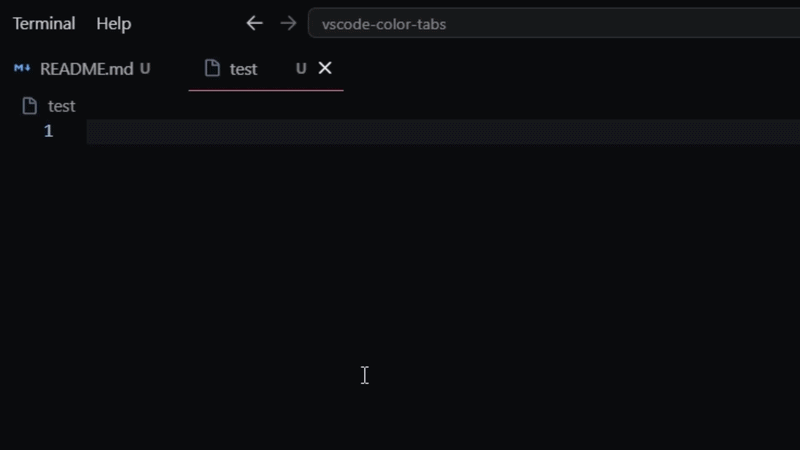

# Colorful Tabs — VS Code Extension

A Visual Studio Code extension that lets you tag any file with a coloured marker.

Right-click a file → **Set Marker** → pick a colour or **No Marker** to clear.

## Installation

Search **"Colorful Tabs"** in the VS Code Extensions panel (`Ctrl+Shift+X`), or [install from the Marketplace](https://marketplace.visualstudio.com/items?itemName=dollhouse-sg.colorful-tabs).

## Markers not showing on tabs?

**Badges disabled** — open Settings and enable `workbench.editor.decorations.badges` (Colorful Tabs will also offer to do this automatically on first use).

**Tab bar is crowded** — VS Code hides tab badges when `workbench.editor.tabSizing` is set to `shrink`. Switch it to `fit` or `fixed`. Markers always show in the Explorer regardless.
